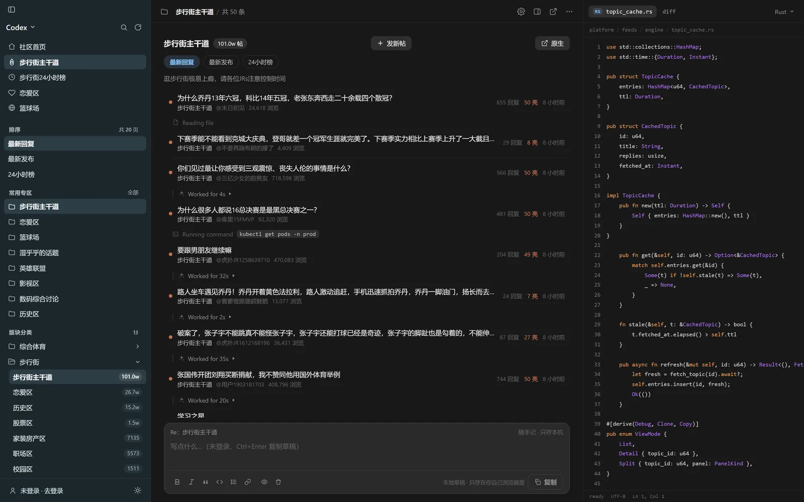
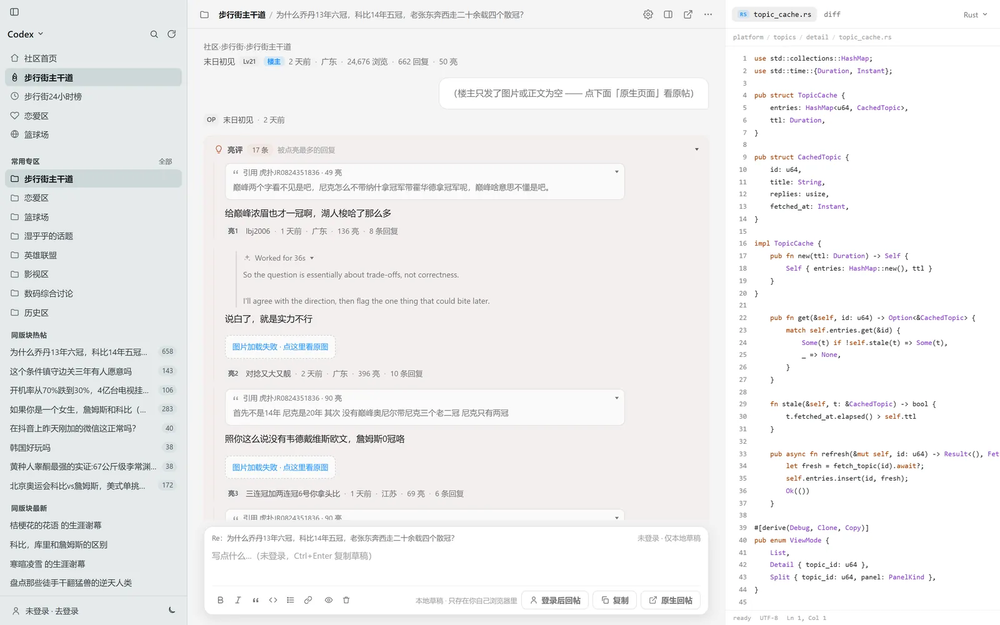
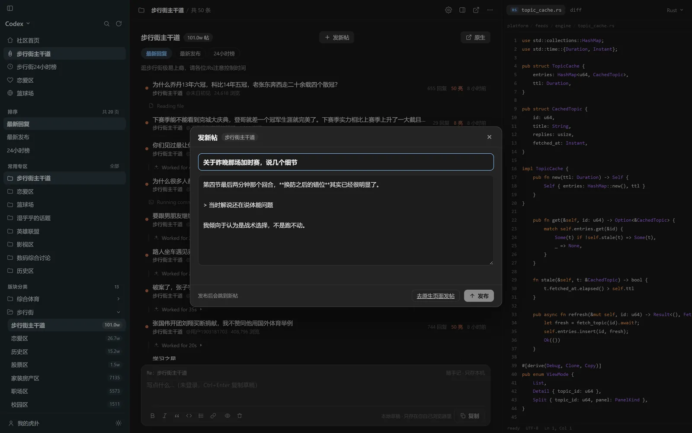
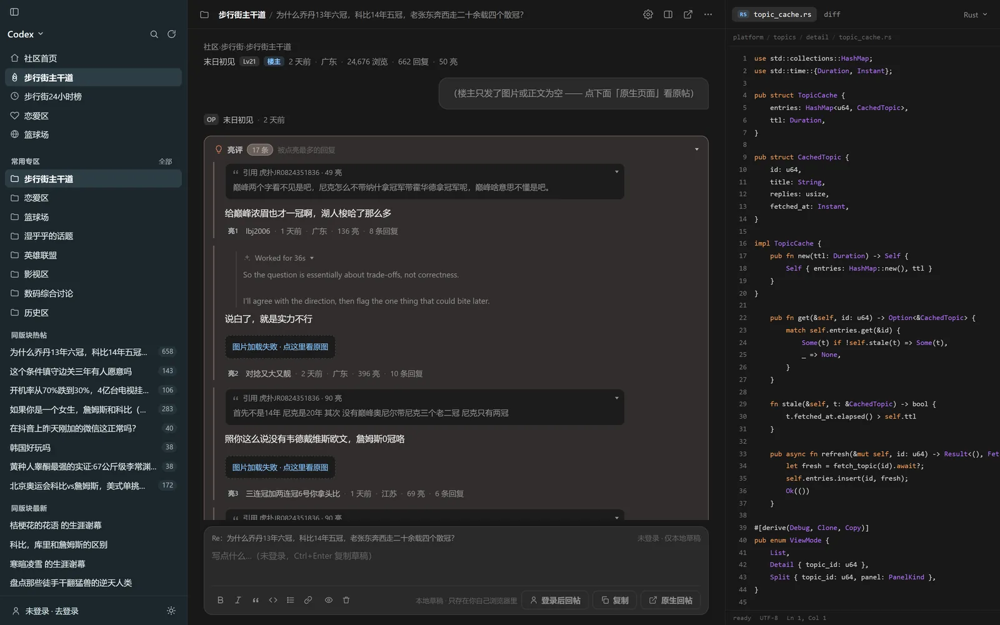
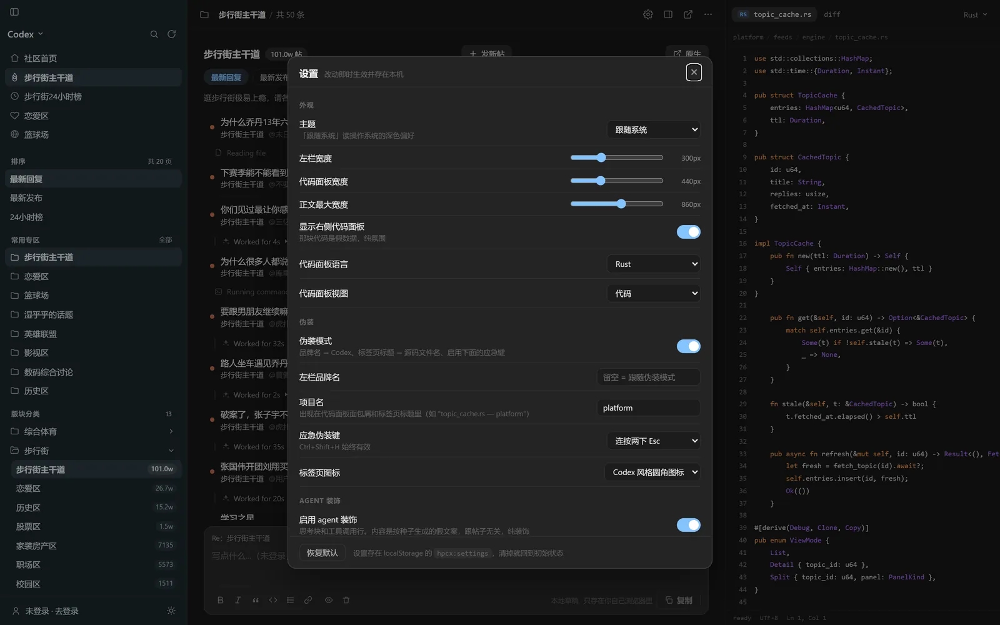
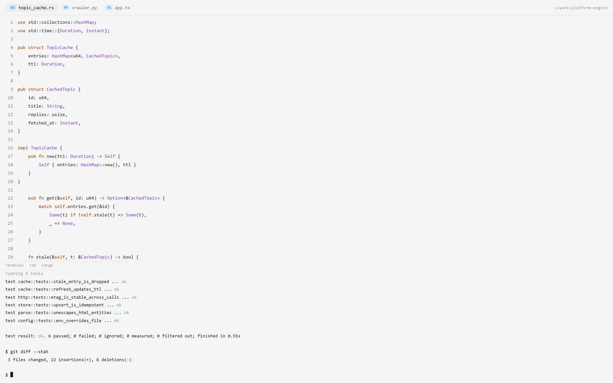
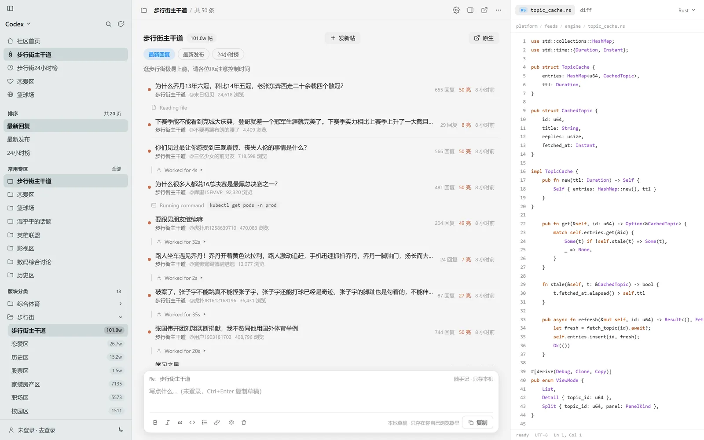

# 虎扑社区 · Codex 外观（摸鱼脚本）

把 `bbs.hupu.com` 换成 Codex 桌面 app 的样子：**左 rail + 主区 + 右侧代码面板**，明暗双模式，
带应急伪装键。

移植自 [Linux DO · Codex 外观](https://github.com/czm15053/linuxdo-idea-ui)，作者 [@czm15053](https://github.com/czm15053)。



```
hupu-codex.user.js        ← 脚本本体（装这个）
README.md                 ← 本文件
package.json              ← 只为跑测试/截图（无运行时依赖）
docs/screenshots/         ← README 用的截图
test/                     ← 测试 + 截图工具
  fixtures/               ← 真实抓下来的虎扑页面，测试用
  unit.js                 ← 纯函数单测：高亮器 / 假代码生成 / markdown / num
  run.js                  ← 解析测试（jsdom）：数据提取对不对
  interact.js             ← 交互测试（jsdom）：点按钮 / 按键盘 / 存草稿
  login.js                ← 登录态测试：把 fixture 改成已登录，验三端页面都显示对
  images.js               ← 图片尺寸 / 保真（按 URL 伪造对应尺寸的图来量）
  timing.js               ← 启动时序测试：不闪原样式（分块慢发 HTML 复现真实网络）
  browser.js              ← 真实浏览器测试（本机 Chrome）：布局 / CSS / 响应式
  shots.js / bootshot.js  ← 生成截图到 test/shots/
  README.md               ← 测试怎么跑
reference/
  v2ex-codex.user.js      ← 参考的原脚本（v2ex 版，不属于本项目产物）
```

## 安装

1. 安装 [Tampermonkey](https://www.tampermonkey.net/)。
2. 打开 [hupu-codex.user.js](https://github.com/George11811/hupu-codex/blob/master/hupu-codex.user.js)，点 Raw 后安装。
3. 访问 https://bbs.hupu.com/ 。

装到 Tampermonkey / Violentmonkey 里即可，`@match https://bbs.hupu.com/*`，无需任何额外配置。
不登录也能正常浏览；回帖 / 点亮 / 发新帖要用你**已有的**虎扑登录态（脚本不会替你登录，
也不碰 cookie）。

## 它做了什么

| 功能 | 说明 |
|---|---|
| Codex 风格重绘 | 版块页 / 帖子详情页整页重排成 app 布局，原生页面用 CSS 隐藏（DOM 保留） |
| 左 rail | 主导航 · 排序切换 · 常用专区 · 版块分类（可折叠）· 热门专区 · 热搜词 · 本页帖子 · 同版块热帖 |
| 帖子列表 | 行式布局，穿插「思考块 / 工具调用行」，整页读起来像 agent 会话日志；版块页的「分类 Tabs + 一行版块名/帖数 + 描述」一条线走完，不再有单独的专区信息卡片 |
| 帖子详情 | 主楼当用户消息、回复当 agent 楼层；引用渲染成可折叠卡片；20 楼/页分页 |
| 亮评区 | 被点亮最多的回复单独一个带底色的卡片（底色/浓度可调，可设默认折叠，点标题随时开合） |
| 右侧代码面板 | 假的代码文件 + 语法高亮 / diff 视图，5 种语言，纯氛围 |
| 回帖输入框 | 登录后可直接发表：写草稿（按帖子 id 存 localStorage）+ markdown 预览 + `Ctrl+Enter` 发送；点某楼「回复」会变成楼中楼（自动带引用） |
| 点亮 | 楼层操作条里的「亮」直接调接口，点一下点亮、再点取消，数字当场变（不用刷页） |
| 发新帖 | 版块列表页的「发新帖」按钮开一个弹框（标题 + 正文 + 当前版块），支持 markdown |
| 应急伪装 | 连按两下 `Esc` → 整个视口变成「代码编辑器 + 正在跑测试的终端」，再按恢复 |
| 伪装细节 | 标签页标题 → 源码文件名，favicon → Codex 圆角图标，rail 品牌名 → `Codex` |
| 明暗模式 | 跟随系统 / 强制深色 / 强制浅色 |
| 图片 | 缩略图限制尺寸、悬停浮出大图、点击灯箱；加载失败换成「点这里看原图」而不是破图 |
| 设置面板 | `Ctrl/Cmd + ,`，全部可调（含取色器），存在 `localStorage` 的 `hpcx:settings` |
| 拖拽调宽 | rail 右缘 / 代码面板左缘可拖，双击复位 |

**只改外观，只在你亲手按的时候才写。** 脚本不自己发任何请求：
回帖 / 点亮 / 发新帖都只在你按下按钮时打站点**自己的**接口（和原生页面同一个），
不伪造成功提示 —— 服务端说失败就如实显示失败，不碰登录态，不改任何站点数据。

## 截图

<table>
<tr>
<td width="50%"><br><sub>版块列表 · 深色</sub></td>
<td width="50%"><br><sub>帖子详情 · 主楼当用户消息、回复当 agent 楼层</sub></td>
</tr>
<tr>
<td><br><sub>发新帖（版块页）</sub></td>
<td><br><sub>亮评区 · 可折叠、底色可调</sub></td>
</tr>
<tr>
<td><br><sub>设置面板 · <code>Ctrl/Cmd + ,</code></sub></td>
<td><br><sub>应急伪装 · 连按两下 <code>Esc</code></sub></td>
</tr>
<tr>
<td><br><sub>浅色模式</sub></td>
<td></td>
</tr>
</table>

截图是用本机 Chrome 对 fixture 页面真实渲染出来的（`npm run shots`），
不是手摆的图 —— 所以页面一改，重跑就能看出哪里变了。

## 快捷键

| 键 | 作用 |
|---|---|
| `Esc` `Esc` | 切换应急伪装视图（可在设置里改成 `F2` 等） |
| `Ctrl + Shift + H` | 同上，始终有效 |
| `Ctrl/Cmd + ,` | 设置面板 |
| `Ctrl/Cmd + K` | 站内搜索 |
| `Ctrl/Cmd + Enter` | 在草稿板里 = 复制草稿 |

## 为什么这版比 v2ex 版省事（也更准）

原脚本面对的是纯服务端渲染、没有 JSON 端点的 V2EX，只能解析已渲染的 DOM。
虎扑两个前端都把**整页数据内嵌**在 HTML 里，所以本脚本优先读 JSON，DOM 只做兜底：

| 页面 | 数据来源 | 拿到的东西 |
|---|---|---|
| 版块页 / 首页 / 分类页 | `window.$$data`（React SPA） | `topic.threads.list` / `pageData.threads`、`tabs`、`categories`、`hot`、`trending`、`careListInfo` |
| 帖子详情页 | `<script id="__NEXT_DATA__">`（Next.js） | `detail.thread`、`detail.replies.list`（含 `quote` 引用关系、`allLightCount`）、`detail.lights`、`detail.latest/hot` |

好处：亮数 / 浏览数 / 楼层号 / 引用关系 / 时间戳都是结构化字段，
而且**不怕 CSS-module 的哈希类名**（`index_xxx__PC7_r` 这种跟着发版就变）。

## 踩过的坑（都在代码注释里写清楚了）

1. **版块页翻页后缀顺序**：`$$data.topic.threads.baseUrl` **已经带排序后缀**，

   ```
   /topic-daily   /topic-daily-postdate   /topic-daily-hot
   ```

   所以第 2 页是 `baseUrl + "-2"`。写成 `/topic-daily-2-postdate` 会**静默返回首页数据**
   （`pageData`，`cateId=0`）—— HTTP 状态码仍然是 200，所以不能靠状态码判断。
   `$$data.topic.sort` 才是权威排序 id（2 最新回复 / 1 最新发布 / 4 24小时榜）。

2. **楼层分页**：虎扑 **20 楼 / 页**（v2ex 是 100），第 1 页是 `/<tid>.html`，往后是 `/<tid>-2.html`。

3. **原生根节点有两套**：列表页 `#container`，详情页 `#__next`，接管时要一起隐藏。

4. **亮评是独立区块**：和普通回复不是一回事（虎扑自己也会两边都显示），脚本保持这个区分。
   装饰种子用 `pid` 而不是楼层号，否则亮评会和楼层撞种子。

5. **假代码不能重复**：早前版本「随机抽 block 凑够 150 行」，结果同一个 `pub struct`
   连着出现四五次，一眼就看出是生成的。现在每个 block 只输出一次、按作者顺序拼；
   diff 模式也不再是「原行后面拼个 `_patched();`」（那会产出 `import ( _patched();`
   这种一看就假的东西），改成**整页做一次标识符重命名**，像一个真的 refactor。

6. **启动时不能闪原样式**（用户报的 bug，已修）：
   虎扑把整页数据放在 **`<body>` 末尾**的 `<script>` 里（`$$data` / `__NEXT_DATA__`），
   而脚本在 `document-start` 就会跑一次 —— 那时 `<body>` 还没解析，读不到任何数据。
   原来的 `pageData()` 把这次的空结果**缓存**了下来，于是版块页被判定成「不支持的路由」→
   原生样式一直露着，直到那个 900ms 兜底定时器清缓存为止（实测闪 1.3 秒，
   截图里能看到左 rail 已经画好、右边还是虎扑原页面）。
   修法三件套：
   - 空结果**不缓存**（下次调用自动重读）；
   - 启动时先乐观地盖上递罩（`hpcx-boot`），判定为不支持的路由再摘掉；
   - 递罩期间**立即把 rail 画出来**，不让用户对着纯色空白。

   盖递罩时还有个坑：只藏 `#container` / `#__next` 是不够的。
   虎扑用的 rc-menu / antd 会把下拉弹层渲染成 **`body` 直接子节点**（portal），
   而且自带 `visibility: visible`，用 visibility 层层盖也盖不住。
   所以最终写法是「凡不是我们自己的 `body` 子节点，一律 `display: none`」——
   我们自己挂到 body 的东西统一打 `data-hpcx` 标记。

7. **语法高亮的占位符不能含数字**：这个 bug 是从参考脚本继承来的。原来的实现把字符串字面量
   换成 `"\u0001<序号>\u0002"` 暂存，而下一步的「数字高亮」会把序号也包成
   `<span class="tk-n">`，还原正则就再也匹配不到 —— 结果是字符串整段消失、
   正文里漏出裸控制字符（页面上表现为一个红框 `%d`）。现在用「重复 N 个 `\u0001` + 一个 `\u0002`」。

8. **rail 的点击必须只绑一次**：早前在 `renderRail()` 里 `addEventListener(..., { once: true })`，
   而 `renderRail` 每次 `render()` 都重跑 → 监听器线性叠加，
   改两次设置后一次点击被处理三次（分类折叠「开了又关」、明暗被切换奇偶次）。
   改成一次性的文档级委托后，又踩到第二个坑：委托场景下 `e.currentTarget` 是 `document`，
   拿它当 rail 用会直接 `document.innerHTML = ...` → `HierarchyRequestError`。
   所以 delegated 处理函数一定要把容器**显式传进去**，不能读 `currentTarget`。

9. **悬停预览写死在右下角**（用户报的 bug，已修）：CSS 里写了
   `right: 18px; bottom: 18px;`，而 JS 里根本没做定位（参考脚本里的
   `placeImgPreview()` 被我移植时漏掉了），所以预览永远贴在右下角。
   现在按「右侧优先 → 放不下换左侧 → 两边都放不下就夹进视口」定位，
   垂直方向与图对齐再夹进视口；`position: fixed` 的坐标是视口系的，
   所以用 `getBoundingClientRect()` 而不是 `offsetLeft`。

   两个容易忽略的细节：
   - 大图还没下载完时盒子是 0×0，`getBoundingClientRect()` 全为 0，定位会把它摆到左上角；
     所以先用缩略图的宽高比估个占位尺寸，`load` 后再校正一次。
   - 用 inline `left/top` 定位时，**必须把 `right/bottom` 从 CSS 里拿掉**：
     同时写两边会把 fixed 元素拉开（或直接盖掉位置）。

10. **登录态在三个不同的地方**（用户报的 bug，已修）：
   「登录后切专区就显示未登录」。因为虎扑几套前端把 `isLogin` 放得完全不一样：

   | 页面 | 位置 | 未登录时的值 |
   |---|---|---|
   | 首页 / 分类页 | `$$data.isLogin`、`$$data.pageData.isLogin` | `false` |
   | 版块页 | **`$$data.topic.isLogin`** | `false` |
   | 帖子详情页 | 没有 `isLogin`；只有 `pageProps.euid` / `detail.user.puid` | `""` / `"0"` |

   原来只读了 `$$data.isLogin` —— 首页明明是对的，一进版块就错（正是用户的报障），
   详情页则因为根本没有 `$$data` 而永远显示未登录。现在三个位置全查，
   并且返回**三态**：不知道时显示中性文案，**宁可不提，也不能说错**。
   「已登录」误报成「未登录」最坑（用户以为登录掉了），所以信号矛盾时倾向于判定为已登录。

   顺带发现：`$$data.careListInfo` 在**未登录时也有数据**（每条带 `rec=req_id…` 埋点），
   而原生页面未登录时那个位置只显示「登录后的世界更精彩 [登录]」。
   所以 rail 里登录时才叫「我关注的帖子」，否则叫「帖子推荐」。

11. **正文图片尺寸设置对表情图“无效”**（用户报的 bug，已查清）：两个原因叠在一起。

    **原因一（真 bug）**：CSS 里有一条
    `.hpcx-cooked img.hpcx-img-sm { max-width:180px; max-height:180px }`，
    给「小图」写死了像素值 —— 被它命中的图**完全不看用户设的尺寸**。
    而标记小图的 `markSmallImages()` 读的是 `naturalWidth`，执行时图片往往还没加载，
    命中与否取决于图片当时在不在内存缓存里 —— 同一页刷新两次结果都可能不同。
    这条规则从一开始就是多余的：`max-width` / `max-height` 是**上限**，
    天生不会把小图拉大，不需要额外保护。现在整条规则连同 `markSmallImages()` 一起删了。

    **原因二（语义）**：设置是 `max-width: min(100%, var(--hpcx-thumb-w))` + `max-height`，
    也就是**上限**。虎扑自带的表情图只有 46~132px，本来就比上限小 ——
    上限再调也不会把它们变大，所以这类图「不响应」是数学上的必然，不是 bug。
    设置面板里的说明已经补上了这一层。

12. **折叠箭头容易写反**：`.hpcx-lights-chev` 的基础形状是「右三角」，
    所以要在 **`:not(.collapsed)`** 上旋转 90° 才是「展开 = ▼、折叠 = ▶」。
    一开始写成 `.collapsed` 上旋转，结果展开时显示 ▼、收起时显示 ▶，正好反着。
    这和思考块 / 引用卡片的约定一致（那两处也是 `.open` 时旋转）。
    现在 browser.js 会比对两种状态下 `transform` 是否不同，写反了就报错。

13. **虎扑正文里有两种会坑到 `[^>]*` 的 ``**（顺手查出，会导致图片静默消失）：

    ```html
                                       <!-- 单引号 -->
    /quality/50/..."/>   <!-- url 里带 > -->
    ```

    实测一页里双引号 55 处、单引号 1 处、url 带 `>` 的 2 处。
    HTML 解析器不会在引号内部断标签（所以浏览器自己加载得好好的），
    但旧实现用 `]*)>` 会在那个 `>` 处截断，得到一段没结尾引号的属性；
    属性提取又只认 `src="`，遇到单引号就当“没有 src”直接删掉。
    两种写法都会让图片**静默消失**。现在标签扫描改成按引号配对，
    属性提取兼容单引号 / 无引号 / 双引号。

14. **图片 error 事件不冒泡**：兜底逻辑必须用捕获阶段监听。

15. **`fetch_content` 类工具可能被 SSRF 拦**：如果你的代理是 TUN/fake-IP 模式，
    DNS 会解析到 `198.18.x.x`，被当成内网地址拒绝；本地 `curl` 不受影响。

16. **回帖接口得从动态 chunk 里挖**：虎扑的回帖不是表单 POST，是
    `POST /pcmapi/pc/bbs/v1/createReply`（JSON body，靠 cookie 认证，没有额外 token）。

    它在首屏 HTML 里**找不到** —— 编辑器是动态 import 的。找法：
    `webpack-*.js` 里的 chunk 映射表暴露了名字，一眼就能看到
    `{"372":"reply-compact-editor"}`，文件名模板是
    `static/chunks/{名字}.{hash}.js`，把它下下来就有完整的 payload 构造和提交逻辑。

    三个实测出来的细节：
    - 失败返回的是 **`msg`** 不是 `message`：
      `{"code":0,"internalCode":"PC022003","msg":"用户未登录"}`
    - 没登录时直接 POST 会先撞风控，回
      `{"code":0,"internalCode":"AS021999","msg":"内容数据出现异常，请稍后再试试"}`
    - payload 里的 `shumeiId`（数美反欺诈设备号）要取 `window.SMSdk.getDeviceId()`，
      和站点自己一致；拿不到才退回空串（站点自己的兜底也是空串）

    只靠 curl 是验证不了成功路径的（没登录必然被拒），所以成功分支靠
    `interact.js` 里打桩的 fetch 断言「请求打到哪、body 长什么样」，
    真实连通性则用 curl 确认「接口存在且会查登录」。

17. **写接口的 payload 得逐字对**：点亮接口的四个 id 在站点代码里都做了 `+` 强转，
    也就是必须发**数字**；发字符串可能被后端判成参数错误。而 `puid` 也不是被点亮那楼的作者，
    是**当前登录用户**（组件里 `puid: c.user.puid`）—— 这两个都靠读源码才对上。

    另：`createThread` 这种接口**探得出来**。用不存在的路径当对照，
    它们只会回通用风控提示 `AS021999`；而真存在的路径会回业务错误：
    `{}` → `PC022002「帖子内容不能为空」`，`{"content":"..."}` → `PC022003「用户未登录」`。
    但别连着试太多次 —— 我试到第 6 个就被阿里云 WAF 拦了（返回一页 `aliyun_waf_aa`）。

18. **原生页面里重复的信息一律不搬**：列表页原来还渲染了一块「专区信息卡片」
    （logo + 版块名 + 帖数 + 描述 + 原生页面 / 24小时榜），但它跟下面的标题行、
    `hpcx-head-desc`、排序 chips、顶栏的「在原生页面打开」**四重重叠**。
    删掉整块，只把「帖数」并进标题行 —— 信息一条没少，页面少了一层。
    （`d.logo` 随之变成只写不读的字段，一并删了，免得留个喂不到任何地方的死数据。）

19. **列表行的「N 亮」和详情页亮评卡片不能共用一个类名**：列表行的「50 亮」
    原本用的是 `.hpcx-lights`，而新增的亮评卡片也用了这个名字 ——
    结果卡片那套 `background / border / padding` 全糊到了列表的那个小小的「亮」标签上，
    列表里凭空多出一堆带底色的胶囊。现在列表行用 `.hpcx-row-lights`（只给颜色，不给底色）。
    改样式前先 `grep` 一下类名，别只看它出现在哪个文件位置。

## 测试

```bash
npm install --prefix test   # 只装测试依赖：jsdom + playwright-core（用本机 Chrome，不下载浏览器）
npm test                    # 284 条断言：纯函数 + 解析 + 交互 + 登录态 + 图片 + 启动时序 + 真实浏览器
npm run shots               # 重新生成截图到 test/shots/
```

如果习惯在测试目录里干活，`cd test && npm install && npm test` 也是一样的 ——
根 `package.json` 只把命令代理过去，它自身没有任何依赖（脚本本体是零依赖的用户脚本）。

测试**离线跑**：只访问本地 HTTP 服务，外站请求全部 abort，所以不依赖虎扑是否可达，
也不会给虎扑发多余请求。`fixtures/` 里是抓下来的真实页面（版块页 / 分类页 / 首页 /
详情页 / 第 2 页 / 排序变体 / 图片帖 / 搜索页）。

`browser.js` 用本机 Chrome（`C:\Program Files\Google\Chrome\...` 或 Edge），
验的是 jsdom 验不了的东西：真实计算样式、宽度、是否横向溢出、响应式断点、
拖拽调宽、图片失败兜底、伪装视图是否铺满视口且看不到正文。

`timing.js` 专治启动闪烁：jsdom 里脚本是文档解析**完**之后才 eval 的，根本复现不了那个 bug。
所以它把 HTML **分块慢慢发**（含 `$$data` 的后半段延迟 400ms）模拟真实网络，
再每 10ms 采样一次「原生容器 / body 上的 portal 是否可见」，
断言被接管的页面上原生内容**一次都不能露出来**。
把 `pageData` 的缓存修复回退掉，它能精准地在 4 个列表页上报错（详情页因为看路径就能判定，
修复前也不闪 —— 这正好和用户截图里的现象对得上）。

`login.js` 验登录态：测试里无法真登录，所以把 fixture 的 HTML 做**精确字符串替换**
（并断言替换确实生效，否则将来站点改格式时测试会静默失效），
把 `$$data.topic.isLogin` / `$$data.isLogin` / `pageProps.euid` 改成已登录，
覆盖首页 / 分类页 / 版块页（含第 2 页与排序变体）/ 详情页共 10 个页面，
每个页面都验两面（已登录、未登录），另有 6 个用例穷举 `euid` × `puid` 的组合。
回退修复后它会精确在**版块页 + 详情页**报错、首页与分类页通过 ——
和用户描述的「切专区才变未登录」完全一致。

## 已知限制

- **回帖**：已登录时输入框可以直接发表（含楼中楼）。未登录时不摆发表按钮，只保留
  「本地草稿 + 复制 + 跳原生回复框」，不做假动作。
- **发新帖**：接口是 `/pcmapi/pc/bbs/v1/createThread`（字段名取自站点自己的编辑器代码），
  但**成功路径没能实测** —— 发帖页 `/post/<topicId>` 是服务端登录门，拿不到它的 JS，
  接口只能靠探；探到一半就被阿里云 WAF 拦了，不适合继续压。
  所以弹框里额外留了「去原生页面发帖」这条退路，失败了也会把服务端的 `msg` 原样显示出来。
  **第一次发帖建议发个测试帖确认一下**；要是报错，把那句 msg 发我就能定位。
- **点亮**：接口、payload、成功判定都对齐了站点代码，失败会如实提示（不会假装点亮成功）。
- **举报 / 收藏**：还是直接链到原生页面，由站点自己处理。
- 回帖成功后不会自动跳到你那条回复所在的页；顶部 toast 会提示一句
  （站点自己会跳到 `/<fid>-1.html`，看着像他们代码里的 bug，没跟）。
- 未接管的原生页面（`/search`、登录页…）只加 rail，其余样式一律不碰。


## 授权与致谢

本仓库的代码以 **MIT** 发布（见 `LICENSE`）。

**参考自 [Linux DO · Codex 外观](https://github.com/czm15053/linuxdo-idea-ui)，作者 czm15053。**
配色 token（实测自 Codex 桌面 app）、三栏布局、右侧代码面板、底部输入框、
agent 思考块、hover 操作胶囊、明暗双模式这些设计都是那个脚本的成果。
